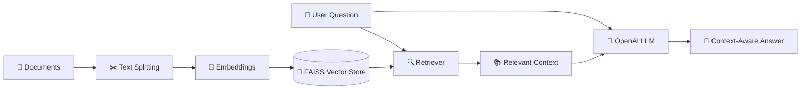

# 🔎 Retrieval-Augmented Generation (RAG) with LangChain, FAISS & OpenAI

A complete **Retrieval-Augmented Generation (RAG)** implementation built using **LangChain**, **FAISS**, and **OpenAI**. This project demonstrates how Large Language Models (LLMs) can be enhanced with external knowledge by retrieving relevant information from multiple document sources before generating a response.

The project is implemented in a **Jupyter Notebook**, making it easy to understand and experiment with each stage of the RAG pipeline.

---

## 🧠 What is RAG?

Retrieval-Augmented Generation combines **information retrieval** with **Large Language Models**.

Instead of relying entirely on the knowledge already stored inside an LLM, a RAG system searches an external knowledge base for relevant information and provides that context to the model before generating the final response.



---

## ✨ Features

* 📄 Load and process information from multiple document sources
* ✂️ Split large documents into manageable text chunks
* 🧠 Convert text into numerical vector embeddings
* ⚡ Store and search embeddings efficiently using FAISS
* 🔍 Retrieve semantically relevant document chunks
* 🤖 Generate context-aware responses using OpenAI models
* 🔗 Build an end-to-end RAG pipeline with LangChain
* 📓 Explore and execute the complete workflow in Jupyter Notebook
* 🎯 Reduce hallucinations by grounding responses in retrieved context

---

## 🏗️ RAG Architecture

The complete workflow follows this pipeline:

```text
Multiple Data Sources
        │
        ▼
Document Loading
        │
        ▼
Text Splitting
        │
        ▼
Embedding Generation
        │
        ▼
FAISS Vector Store
        │
        ▼
User Question
        │
        ▼
Similarity Search
        │
        ▼
Relevant Context Retrieval
        │
        ▼
Prompt + Retrieved Context
        │
        ▼
OpenAI LLM
        │
        ▼
Final Answer
```

### How it works

**1. Document Loading**

Documents are loaded from multiple supported data sources and converted into a standardized document format.

**2. Text Chunking**

Large documents are divided into smaller chunks so they can be efficiently embedded and retrieved.

**3. Embedding Generation**

Each chunk is transformed into a numerical vector representation using an embedding model.

**4. Vector Storage**

The generated embeddings are stored inside a **FAISS vector database** for fast similarity search.

**5. Retrieval**

When a user submits a question, the system searches FAISS and retrieves the most semantically relevant document chunks.

**6. Context Augmentation**

The retrieved information is added to the prompt as external context.

**7. Response Generation**

The augmented prompt is passed to the OpenAI language model, which generates an answer grounded in the retrieved information.

---

## 🛠️ Tech Stack

| Technology       | Purpose                                     |
| ---------------- | ------------------------------------------- |
| Python           | Core programming language                   |
| LangChain        | Building and orchestrating the RAG pipeline |
| FAISS            | Vector storage and similarity search        |
| OpenAI           | LLM and AI capabilities                     |
| Jupyter Notebook | Interactive development environment         |
| Embeddings       | Converting text into vector representations |

---

## 📂 Project Structure

```text
RAG-Project/
│
├── data/                  # Source documents
│
├── notebooks/
│   └── rag.ipynb          # Main RAG implementation
│
├── requirements.txt       # Project dependencies
├── .gitignore             # Files excluded from Git
└── README.md              # Project documentation
```

> Modify the structure above to match the actual files in your repository.

---

## ⚙️ Installation

### 1. Clone the repository

```bash
git clone <YOUR_REPOSITORY_URL>
cd <YOUR_REPOSITORY_NAME>
```

### 2. Create a virtual environment

```bash
python -m venv venv
```

Activate it on Windows:

```bash
venv\Scripts\activate
```

For macOS/Linux:

```bash
source venv/bin/activate
```

### 3. Install dependencies

```bash
pip install -r requirements.txt
```

Alternatively, install the core packages manually:

```bash
pip install langchain langchain-openai faiss-cpu python-dotenv jupyter
```

---

## 🔐 Environment Variables

Create a `.env` file in the project directory:

```env
OPENAI_API_KEY=your_openai_api_key
```

Load the environment variables securely in Python:

```python
from dotenv import load_dotenv

load_dotenv()
```

> ⚠️ Never commit your `.env` file or API keys to GitHub.

Add the following to `.gitignore`:

```text
.env
venv/
__pycache__/
.ipynb_checkpoints/
```

---

## 🚀 Usage

Start Jupyter Notebook:

```bash
jupyter notebook
```

Open the RAG notebook and execute the cells sequentially.

The general workflow is:

```python
# 1. Load documents
# 2. Split documents into chunks
# 3. Generate embeddings
# 4. Create the FAISS vector store
# 5. Configure the retriever
# 6. Connect the retriever with the LLM
# 7. Ask questions about the documents
```

Example:

```python
question = "What are the key insights from the provided documents?"

response = rag_chain.invoke(question)

print(response)
```

The system retrieves relevant information from the indexed documents and uses it as context for generating the final answer.

---

## 🔄 RAG Workflow

```text
User Query
    ↓
Convert Query to Embedding
    ↓
Search FAISS Vector Store
    ↓
Retrieve Relevant Chunks
    ↓
Combine Context + Question
    ↓
Send Augmented Prompt to OpenAI
    ↓
Generate Context-Aware Response
```

---

## 💡 Why Use RAG?

Traditional LLM applications depend mainly on the model's pre-trained knowledge. This can create limitations when working with:

* Private documents
* Domain-specific information
* Custom datasets
* Frequently updated information
* Knowledge outside the model's training data

RAG helps address these limitations by allowing the model to retrieve external information at query time.

---

## 📈 Future Improvements

Possible enhancements include:

* [ ] Add a Streamlit or Gradio user interface
* [ ] Add conversational memory
* [ ] Implement history-aware retrieval
* [ ] Add source citations to generated answers
* [ ] Support additional document formats
* [ ] Experiment with different chunking strategies
* [ ] Add hybrid search
* [ ] Implement reranking
* [ ] Compare FAISS with Pinecone and other vector databases
* [ ] Deploy the application as a production-ready RAG service

---

## 🤝 Contributing

Contributions, suggestions, and improvements are welcome.

1. Fork the repository
2. Create a new feature branch
3. Make your changes
4. Commit your changes
5. Push the branch
6. Open a Pull Request

---

## ⭐ Support

If you find this project useful, consider giving the repository a **star ⭐**.

---

## 👨‍💻 Author

**Kirat Anand**

B.Tech Computer Science Engineering
Interested in **Artificial Intelligence, Data Science, Data Engineering, and Generative AI**

---

## 📄 License

This project is intended for educational and learning purposes.
